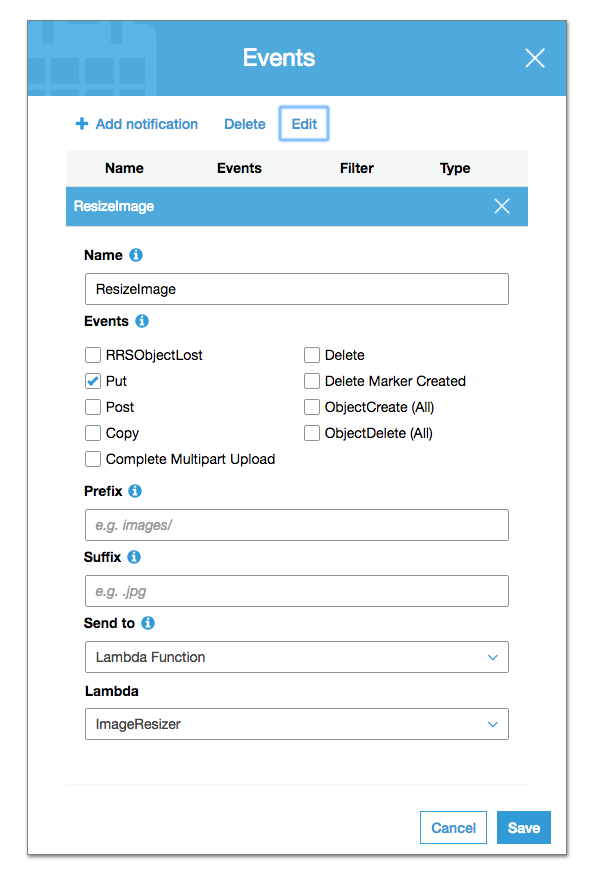
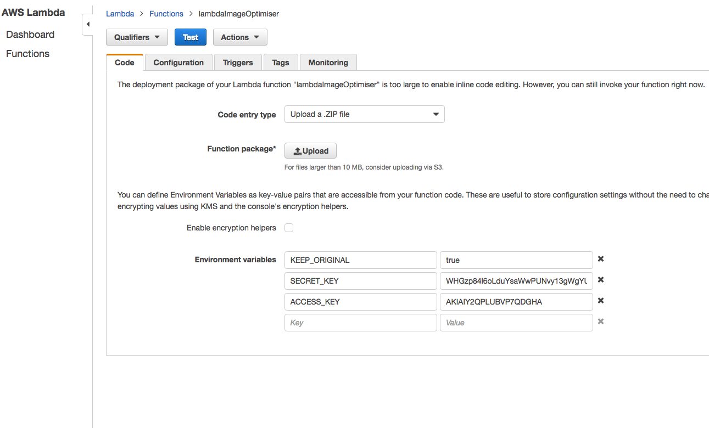

# lambdaImageOptimiser 

This repo can be used as a Lambda function on AWS. 
It will try to optimise any image that is uploaded by checking the original, run it through the code.
If the file size is smaller with the same dimensions, it will be saved.
This will gives us the ability to display optimised images on the front-end by selecting the closest relevant size.

# How does it work
Set up a notification with this Lambda function on an s3 bucket with a 'Put' event.
(Go to the bucket you want this on, click the 'Properties' tab, click on the 'Events' box and 'Add notification' as shown below)

This will now trigger the lambdaImageOptimiser everytime someone uploads an image to this bucket.
The image gets checked for type and GraphicsMagick & ImageMagick will try and optimise it.
The optimised image gets checked for filesize against the orginal and saved if its smaller than the original.
Optionally a copy of the original will be saved (`KEEP_ORIGINAL`).

# Options that need to be (or can be) set in AWS:
- `ACCESS_KEY` - your IAM access key for AWSvis
- `SECRET_KEY` - your IAM secret key for AWS
- `IMG_QUALITY` [optional] (integer ranging from 1 to 100) the image quality to optimise to, this defaults to 85 (the uploaded image quality will be used if this is smaller)
- `KEEP_ORIGINAL` [optional] if this is set, the orignal image will be kept if the optimised image is smaller in file size

# Supported image types
Currently the following are supported:
- PNG, JPG & GIF

# Development
Currently this functionality can't be tested locally, so every change you make needs to go onto the AWS box.
The easiest way to do this is to create a ZIP file of the package (including the `node_modules` directy) and upload it to the lambda function on AWS (see screenshot below)

# TODO:
- Check what happens when image upload is cut off or anything similar in the process of optimising
- Tests
- More config (perhaps the destination folder or path of the original can be in here)
- Cache invalidation
- Make it possible to develop locally
- Add functionality to resize?
- Improve README

---

Please let me know if any of this is not clear.