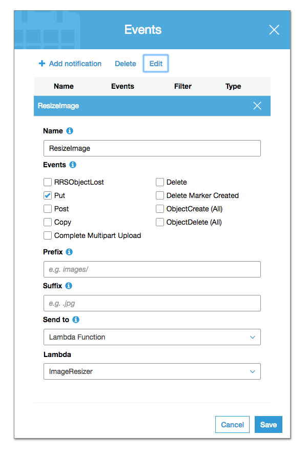

# lambdaImageResizer

This repo can be used as a Lambda function on AWS. 
It will read, check, resize and upload images to 4 different sizes.
This will gives us the ability to display optimised images on the front-end by selecting the closest relevant size.

# How does it work
Set this Lambda function up as a notification on an s3 bucket with a 'Put' event.
(Go to the bucket you want this on, click the 'Properties' tab, click on the 'Events' box and 'Add notification' as shown below)

This will now trigger the ImageResizer everytime someone uploads an image to this bucket.
The image gets checked for type and size after which GraphicsMagick & ImageMagick will resize it to various sizes (see below) and upload it back to the same bucket as the original image.

# Sizes
It currently scales the original image to the following:
- Half of the original size (and will be saved with `_large` in front of the extension)
- Quarter of the original size (and will be saved with `_medium` in front of the extension)
- 1/8th of the original size (and will be saved with `_small` in front of the extension)
- 1/12th of the original size (and will be saved with `_thumbnail` in front of the extension)

# Supported image types
Currently the following are supported:
- PNG, JPG & GIF
